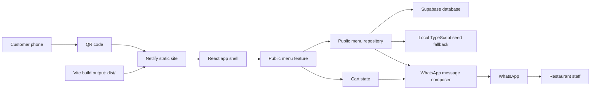
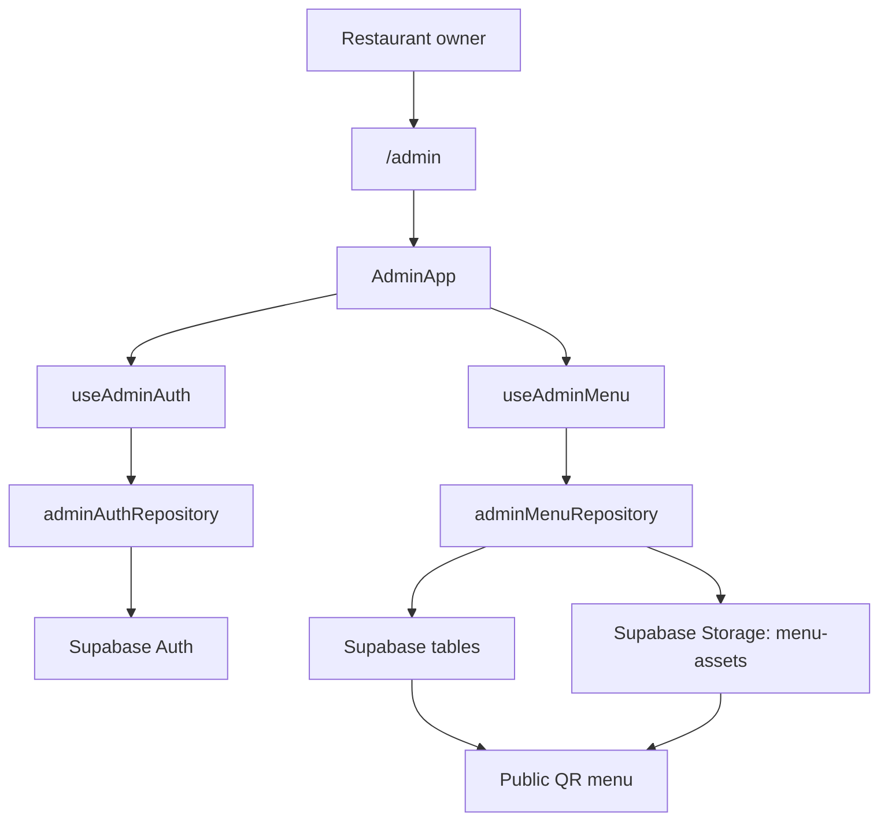
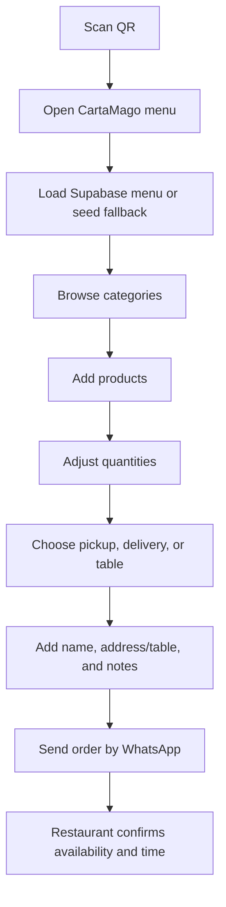
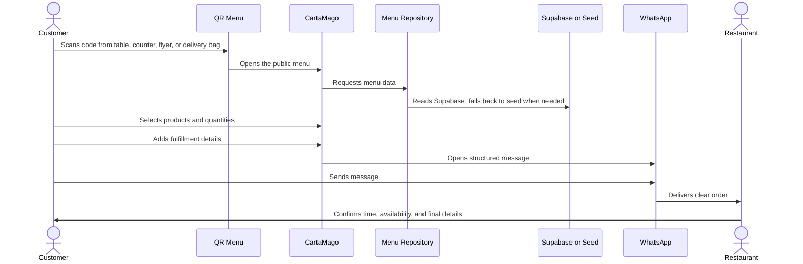
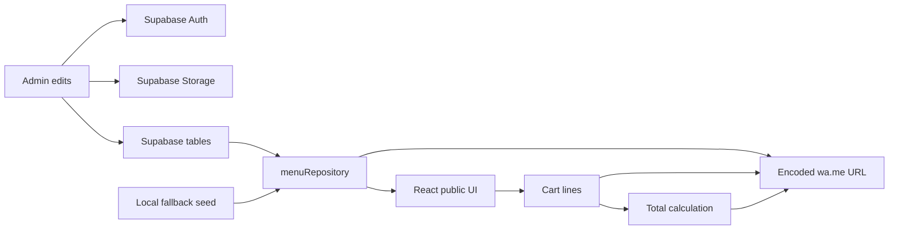
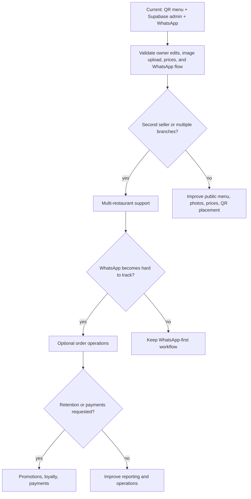
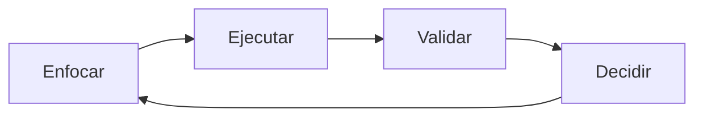
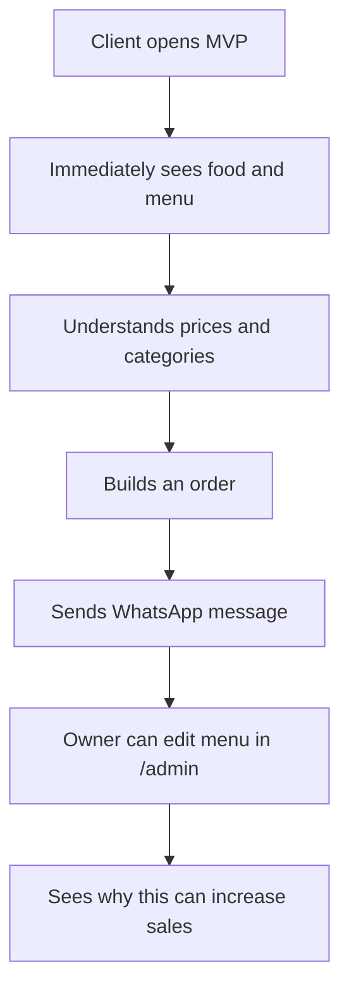

# Diagrams

## Runtime Architecture



## Admin Architecture



## Customer Ordering Flow



## Restaurant Sales Process



## Data Flow



## Phase Evolution



## Agent Work Cycle



Use the classifier before each implementation:

```text
Frente:
Impacto:
Cambio minimo:
Validacion:
Siguiente decision:
```

## MVP Success Criteria


